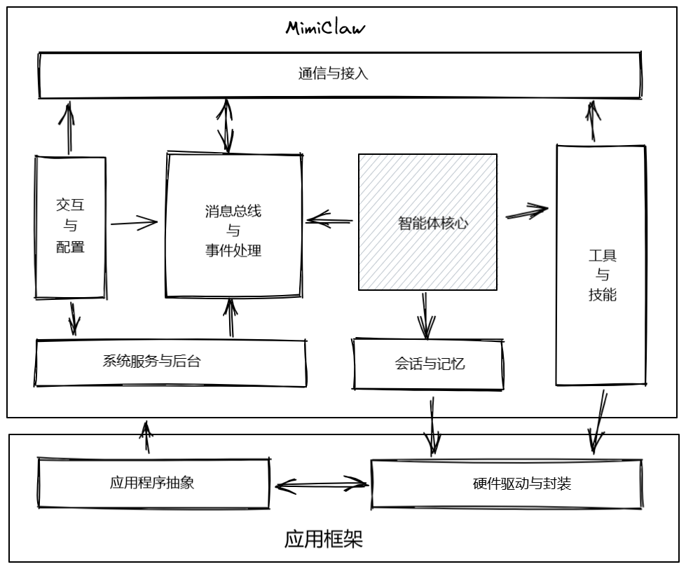
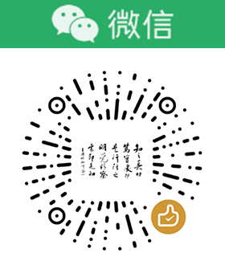

# MimiClaw Arduino

在 ESP32-S3（带 PSRAM）上运行 MimiClaw AI Agent 的 Arduino 程序。<br/>
基于ESP32-Arduino-Framework开发框架。

## 功能特性

- **ReAct 智能体循环** — 自主 AI 智能体，支持工具调用（最多 10 次迭代）
- **双 LLM 支持** — 同时支持 Anthropic Claude 和 OpenAI/Deepseek GPT 模型
- **Telegram 机器人** — 长轮询方式集成 Telegram Bot
- **Feishu 机器人** — 长轮询方式集成 飞书 Bot
- **串口控制台** — 集成串口交互控制台界面
- **WebSocket 服务器** — 实时通信网关
- **持久化记忆** — 基于 SPIFFS 的长期记忆与每日笔记
- **会话管理** — 按聊天分组的对话历史（JSONL 格式）
- **九个内置工具** — 网页搜索、文件读写、时间获取、定时任务调度
- **技能系统** — 从 SPIFFS 加载的可扩展技能文件
- **定时任务调度** — 支持循环和一次性定时任务
- **心跳检测** — 定期检查 HEARTBEAT.md 文件
- **HTTP/SOCKS5 代理** — 所有 API 调用可选代理支持

## 硬件要求

- 带有 **PSRAM** 的 ESP32-S3 开发板（推荐：8MB 以上 PSRAM，16MB Flash）
- WiFi 网络连接
- SD卡模块（可选）

## 依赖库

通过 Arduino 库管理器安装：

- **ArduinoJson** v7.0+，https://github.com/bblanchon/ArduinoJson
- **WebSockets** v2.6+，https://github.com/Links2004/arduinoWebSockets
- **ESP32Console** v1.3, https://github.com/jbtronics/ESP32Console

## 快速开始

1. 安装依赖库（ArduinoJson、WebSockets）
2. 将 `persist-data/` 文件夹上传到存储中
3. 在mimi_secrets.h中填写你的 WiFi、Feishu、Telegram 和 LLM API 凭据
4. 在boards文件夹下创建你的开发板目录，新建开发板类（从Board类继承），实现板上相关硬件驱动
5. 编写相关自定义工具
6. 编译、上传到 ESP32-S3 开发板

### 开发板设置（Arduino IDE）

| 设置项 | 值 |
|--------|------|
| 开发板 | ESP32S3 Dev Module |
| PSRAM | OPI PSRAM |
| Flash 大小 | 16MB (128Mb) |
| 分区方案 | Default with large SPIFFS 或 其它类似方案 |


## 持久化数据

MimiClaw需要文件系统来存储一些信息，数据结构如下：

```
/persist-data/
  config/
    SOUL.md          — AI 人格定义
    USER.md          — 用户信息（自动填充）
  memory/
    MEMORY.md        — 长期持久化记忆
    daily/           — 每日笔记（自动创建）
  sessions/          — 聊天会话文件（自动创建）
  skills/            — 技能文件（自动创建）
  cron.json          — 定时任务配置（自动创建）
```
系统支持各种文件系统，如SPIFFS、FatFS、SDFS等，可根据硬件情况选择和配置<br/>
若简单使用可选SPIFFS，用上传工具将 `persist-data` 文件夹上传至设备，请参考[SPIFFS.md](SPIFFS.md)<br/>
若需要更多存储，可使用SD卡，配置CONFIG_USE_SDFS=1，将 `persist-data` 文件夹上传SD卡内

## 系统架构



## 自定义工具

### 【控制硬件输出】如控制LED

1. 在Board继承类中实现硬件驱动封装，若应用框架未支持，需编写驱动代码，否则可直接实例化后使用，如Ws2812，
```cpp
led_ = new Ws2812Led(pin, num_of_pixels); //led_是成员变量
```
2. 编写工具执行程序
```cpp
bool ledToolExecute(const char* input_json, char* output, size_t output_size) {
    Led *led = Board::GetInstance().GetLed();
    // 解析input_json后，做相关操作
    led->TurnOn(); 
    snprintf(output, output_size, "工具执行结果");
    return true;
}
```
3. 注册工具到MimiClaw
```cpp
MimiTool ledTool = {
    .name = "led_tool",
    .description = "控制LED的开关",
    .input_schema_json = "{\"type\":\"object\",\"properties\":{\"param\":{\"type\":\"string\"}},\"required\":[\"param\"]}",
    .execute = ledToolExecute
};

application->registerTool(ledTool);
```
这一步的input_schema_json描述很关键，它决定了传入到工具函数内的参数，这些参数是由LLM根据文本输入提取出来的。

4. 编写工具使用指南（给LLM用）

这是重重要的一点，Agent通过学习这份指南后，要能懂得在何时调用工具、及如何调用。

### 【从硬件获取数据】如温度传感器数据
1. 在Board继承类中实现硬件驱动封装，若应用框架未支持，需编写驱动代码，否则可直接实例化后使用，如普通数字传感器，可使用实例化DigitalSensor或AnalogSensor后实例。
```cpp
std::shared_ptr<AnalogSensor> temp_ptr = std::make_shared<AnalogSensor>("temp_sensor", pin);
AddSensor(temp_ptr);
```
2. 编写工具执行程序
```cpp
bool tempToolExecute(const char* input_json, char* output, size_t output_size) {
    std::shared_ptr<Sensor> temp_ptr = Board::GetInstance().GetSensor("temp_sensor");
    if (temp_ptr->ReadData()) {  // 读取传感器数据 
        SensorValue *value = temp_ptr->value();
        // 其他处理
    } else {
      // 读取数据失败
    }
    snprintf(output, output_size, "工具执行结果");
    return true;
}
```
3. 注册工具到MimiClaw
```cpp
MimiTool tempTool = {
    .name = "temp_tool",
    .description = "描述这个工具的功能",
    .input_schema_json = "{\"type\":\"object\",\"properties\":{\"param\":{\"type\":\"string\"}},\"required\":[\"param\"]}",
    .execute = tempToolExecute
};

application->registerTool(tempTool);
```
4. 编写工具使用指南（给LLM用）


## 计划
- 飞书机器人支持（已实现）
- SD卡及其他文件系统支持（已实现）
- 语音输入
- 语音输出
- 拍照输入（摄像头支持）
- TFT-LCD显示


## 许可证

MIT — 详见原始 MimiClaw 项目。


## 赞赏

