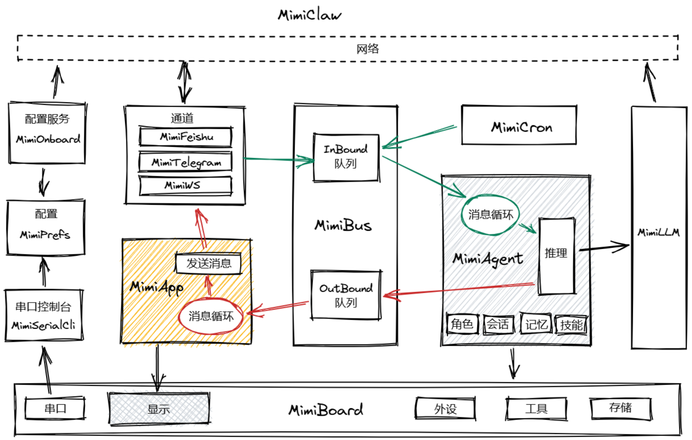

## 快速开始

1. 安装依赖库（ArduinoJson、WebSockets、ESP32Console等）
2. 将 `persist-data/` 内的文件上传到存储中
3. 在mimi_secrets.h中填写你的 WiFi、Feishu、Telegram 和 LLM API 凭据
4. 在boards文件夹下创建你的开发板目录，新建开发板类（从Board类继承），实现板上相关硬件驱动
5. 编译、上传到 ESP32-S3 开发板


## 开发板设置（Arduino IDE）

| 设置项 | 值 |
|--------|------|
| 开发板 | ESP32S3 Dev Module |
| PSRAM | OPI PSRAM |
| Flash 大小 | 16MB (128Mb) |
| 分区方案 | Default with large SPIFFS 或 其它类似方案 |


## 系统架构




## 依赖库

通过 Arduino 库管理器安装

基础依赖库：

- **ArduinoJson** v7.0+，https://github.com/bblanchon/ArduinoJson
- **WebSockets** v2.6+，https://github.com/Links2004/arduinoWebSockets
- **ESP32Console** v1.3, https://github.com/jbtronics/ESP32Console

使用GUI界面依赖库：

- **GFX Library For Arduino**
- **lvgl** v9.0 
- **FT6336** 

## 线程
### 核心线程
|   任务名称   |   描述   |   堆栈  |    优先级    |    运行核    |     文件    |
|-----------|-----------|:---------:|:----------:|:---------:|------------|        
| eventloop_task | 框架事件循环 |    16K   |   2   | Core0  | application.cpp |
| agentloop_task  |  Agent循环    |   24k   |   6   |   Core1  |   mimi_agent.cpp |
| outbound_task   |  消息出栈任务   |  12k   |  5   |  Core0   |  mimi_application.cpp |
| webserver_task  |  Web服务任务    |    4k  |   4   |   Core0   |  mimi_onboard.cpp |

### 通道线程
|   任务名称   |   描述   |   堆栈  |    优先级    |    运行核    |     文件    |
|-----------|-----------|:---------:|:----------:|:---------:|------------|  
| websocket_task  |  WebSocket任务  |    4k  |   4   |   Core0   |   mini_ws.cpp |
| feishu_task    |   飞书WS任务      |   8k   |  5   |   Core0   |    mini_feishu.cpp |
| telegram_task   |  Telegram任务  |    8k   |  5    |   Core0   |   mimi_telegram.cpp |

### 其他线程
|   任务名称   |   描述   |   堆栈  |    优先级    |    运行核    |     文件    |
|-----------|-----------|:---------:|:----------:|:---------:|------------|  
| lvgl_task      | Lvgl刷新任务    |   8k    |  3    |  Core0   |   gfx_lvgl_driver.cpp |


## 持久化数据

MimiClaw需要文件系统来存储一些信息，数据结构如下：

```
/folder/
  config/
    SOUL.md              — AI 人格定义
    USER.md              — 用户信息（自动填充）
  memory/
    MEMORY.md            — 长期持久化记忆
    yyyyMMdd.md          — 每日笔记（自动创建）
  sessions/              
    sess_xxx.jsonl       — 聊天会话文件（按chat_id自动创建）
  skills/                
    weather.md           — 天气查询
    daily-briefing.md    — 每日简报
    skill-creator.md     — 技能创建
    xxxxxx.md            — 自定义技能
  HEARTBEAT.md           — 心跳（定时任务）
  cron.json              — 定时任务配置（自动创建）
  preferences.json       — 配置文件（不使用nvs时）
```
系统支持各种文件系统，如SPIFFS、FatFS、SDFS等，可根据硬件情况选择和配置<br/>
若简单使用可选SPIFFS，配置CONFIG_USE_SPIFFS=1，分区表中要包含SPIFFS分区<br/>
若需要更多存储，可使用SD卡，配置CONFIG_USE_SDFS=1


### LLM请求上下文构成（16kb）
角色：/config/SOUL.md<br/>
身份：/config/USER.md<br/>
记忆：<br/>
-- 长期记忆（4kb）：/memory/MEMORY.md <br/>
-- 短期记忆（2kb）：/memory/yyyyMMdd.md <br/>
技能（2kb）：<br/>
-- /skills/xxx.md<br/>


## 通道