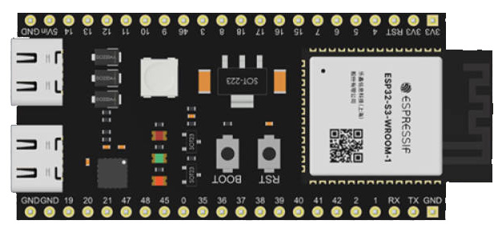

## 安装
要将MimiClaw安装到ESP32上，有两种方式： 
1. 针对普通用户，可以使用我们提供的Release文件，通过刷写程序来安装，此方式只支持项目内置支持的开发板 
2. 针对会Arduino编程的用户，可以使用源程序编译安装，此方式可以支持您自己的ESP32开发板

### 一、选择开发板
要运行MimiClaw程序，需要一个带ESP32-S3模组的开发板，具有至少16MB Flash 和 8MB PSRAM 存储。 

#### 1.内置支持的开发板

ESP32-S3-DevkitC及兼容板 
 
ESP32-S3 2.8寸LCD 盒子（兼容乐高拼搭） 
 
[购买链接](https://www.xpstem.com/)

#### 其它开发板
要使用定制的开发板，需要实现一个定制的开发板类并编写相关硬件驱动代码。 
可在boards目录建子文件夹，然后创建自己的开发板类（继承自Board类，可参考内置开发板类实现） 
在create_board函数中，创建和返回定制的开发板类。

### 二、上传程序

#### 1.使用官方工具上传程序 

工具下载 [链接](https://docs.espressif.com/projects/esp-test-tools/zh_CN/latest/esp32/production_stage/tools/flash_download_tool.html) 

程序下载 
进入[releases/](../releases)页面，根据开发板选择.bin文件下载 
ESP32-S3_DevkitC开发板 选择 mimiclaw-devkitc-v1.x.x.bin  
ESP32-S3-Lcd2.8-box 选择 mimiclaw-lcd2.8-v1.x.x.bin  

上传程序 

#### 2.使用ArduinoIDE编译和上传

选择一个tag，下载源代码到本机 
双击MimiClaw-Arduino.ino打开ArduinoIDE 

选择开发板为"ESP32-S3 Dev Module" 

连接开发板到电脑 

编译并上传 

### 三、配置

申请一个API key

### 四、开始对话
