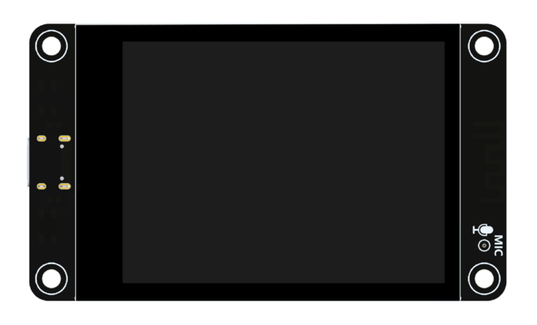
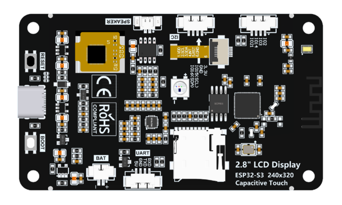

## ESP32-S3 2.8 TFT-LCD 
 

[详情](https://www.xpstem.com/product/board-esp32s3-tft280/index)

### 参数
* 模组： ESP32-S3-WROOM-1
* 存储： FLASH:16MB / PSRAM:8MB
* LCD： 2.8寸 320x240 ILI9341 或 ST7789 SPI
* Touch： FT6336G
* 音频编解码： ES8311
* SD：四线SDMMC
* RGB LED: IO42